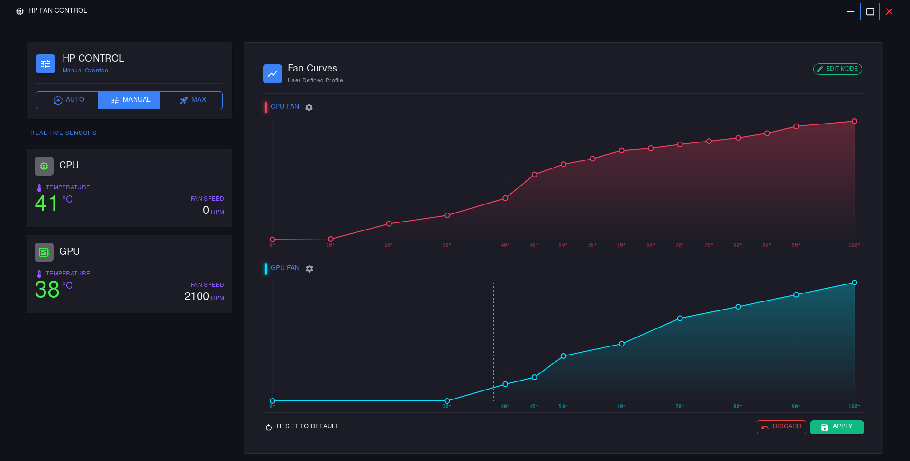
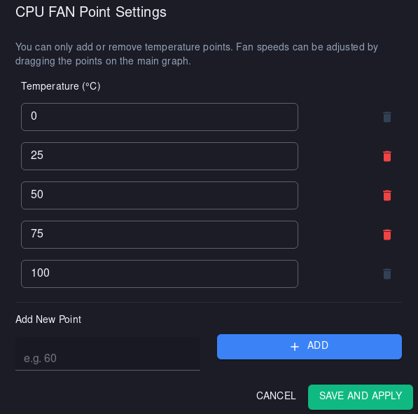
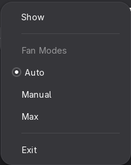

# HP Fan Control (Linux)


A modern, highly optimized Linux desktop application and background service designed for HP Victus series laptops, allowing you to take full control of your thermal management.

<div align="center">
  
  <br><br>
  
  <table>
    <tr>
      <td align="center"><b>Point Settings</b><br></td>
      <td align="center"><b>Tray Menu</b><br></td>
    </tr>
  </table>
</div>

---

## 🚨 Prerequisites (READ THIS FIRST)

> [!IMPORTANT]
> **This application WILL NOT WORK without the custom Kernel Driver.**
> Linux does not allow manual fan control on HP gaming laptops by default. You must install the kernel module first.

Before installing this app, you **must** install the **HP WMI Driver** which exposes the fan PWM controls to the OS. 

1. Go to the driver repository: **[hp-wmi-driver](https://github.com/kursatabayli/hp-wmi-driver)**
2. Follow the installation instructions there. *(Note: You only need to install the kernel driver. Udev rules and hardware permissions are now handled automatically by this UI application!)*

---

## Features

- **Dynamic Curve Editor (NEW):** Create custom fan curves for CPU and GPU independently. Add, remove, and manage temperature anchor points on the fly with smart auto-calculation and safety limits.
- **System Tray Integration:** Runs silently in the background with a native tray menu.
- **Global Keyboard Shortcuts (IPC):** Control fans and toggle the UI instantly via terminal commands without opening the window.
- **Max Mode:** Instantly boosts fans to maximum RPM for peak cooling.
- **Fail-Safe System:** Automatically reverts fans to "Auto" mode if the application crashes or closes.
- **Persistence:** Remembers your last used mode and curves on startup.
- **Live Monitoring:** Displays real-time CPU and GPU temperatures and Fan RPMs.

---

## Installation

1. Download the latest release from the **[Releases Page](https://github.com/kursatabayli/hp-fan-control/releases)**.
2. Extract the archive and open a terminal in that folder.
3. Run the automated installer:

```sh
sudo ./install.sh
```

> **What the installer does:**
> - Installs required system packages via your package manager (`dnf`, `apt`, `pacman`, etc.)
> - Configures hardware permissions (`udev` rules)
> - Creates a global symlink so you can run the app from anywhere
> - Automatically adds your user to the newly created hardware control group
> - Asks if you want to enable background Autostart on login

4. **REBOOT YOUR SYSTEM** for the hardware group permissions to take effect.

---

## Keyboard Shortcuts (Custom IPC Commands)

You can assign custom global keyboard shortcuts in your Desktop Environment settings (e.g., GNOME Settings -> Keyboard -> Custom Shortcuts) using these built-in CLI commands:

**Show/Hide Application UI:**
```sh
hp-fan-control --toggle-ui
```

**Toggle Fan Mode (Auto -> Max -> Manual):**
```sh
hp-fan-control --toggle-mode
```

---

## Test Environment

This software has been developed and verified on the following hardware and software configuration:

| Component  | Detail                    |
| :--------- | :------------------------ |
| **Device** | **HP Victus 16-s0xxx** |
| **OS** | **Fedora Workstation 43** |
| **Kernel** | **Linux 6.18.8** |

---

## Compatibility

| Hardware | Status | Notes |
| :--- | :--- | :--- |
| **HP Victus 16 (s0xxx)** | Verified | Primary development device. Works perfectly. |
| **HP Victus 15** | Unknown | Should work if the WMI path is the same. |
| **HP Omen Series** | **Not Guaranteed** | Architecture differs. This project is verified specifically for HP Victus laptops and functionality on Omen models is not guaranteed. |

| OS / Distro | Status | Notes |
| :--- | :--- | :--- |
| **Fedora 43** | Verified | Primary development OS. Works flawlessly with Wayland/GNOME. |
| **Ubuntu / Debian** | Verified | Supported via automatic dependency installation. |
| **Arch / Manjaro** | Verified | Supported via automatic dependency installation. |

---

## ⚠️ Disclaimer

This software modifies hardware fan settings via a custom kernel module. The software is provided "as is". Running fans at maximum speed continuously or setting them too low during high loads may affect hardware lifespan. The developer cannot be held responsible for any hardware or software issues that may arise from use.

---

### 📄 License

This project is licensed under the [GPL-3.0 License](https://github.com/kursatabayli/HpFanControl/blob/develop/LICENSE)
